# 🏆 LofiStack & AskTechGuy Hackathon Master Plan

**Target**: Maximum Rubric Score (100/100 Target) & Internship Shortlisting  
**Window**: 18:00 – 22:00 BST (4-Hour Hard Start / Hard Stop)  
**Deliverables**: Exactly 2 Problems (5 Deliverables Each)

---

## 📑 Table of Contents
1. [Rubric & Target Strategy](#1-rubric--target-strategy)
2. [Master Timeline & Time Budget (4 Hours)](#2-master-timeline--time-budget-4-hours)
3. [Problem Selection & Triage Protocol](#3-problem-selection--triage-protocol)
4. [Tech Stack & Architecture Standards](#4-tech-stack--architecture-standards)
5. [Standard Deliverables Checklist (Per Problem)](#5-standard-deliverables-checklist-per-problem)
6. [Documentation & Licensing Templates](#6-documentation--licensing-templates)
7. [Proctor & Internship Observation Playbook](#7-proctor--internship-observation-playbook)
8. [Contingency & Emergency Plans](#8-contingency--emergency-plans)

---

## 1. Rubric & Target Strategy

| Category | Weight | Target | Key Scoring Criteria & Action Strategy |
|---|:---:|:---:|---|
| **Functionality** | 25 | 25 | • Pass all 4 required MVP bullets per problem.<br>• Handle real edge cases (input validation, empty states, boundary limits).<br>• Show domain comprehension beyond the surface bullets. |
| **Demo & Documentation** | 20 | 20 | • **Demo Video $\ge$ 60s (8 pts)**: Walk through all 4 MVP bullets live without fluff.<br>• **`README.md` (6 pts)**: Purpose, quickstart, architecture, mocked features, roadmap.<br>• **`LICENSES.md` (4 pts)**: Strictly permissive licenses (MIT/Apache-2.0/BSD).<br>• **Submission Completeness (2 pts)**: Accurate fields, public URLs. |
| **Problem Difficulty** | 15 | 15 | • Target **2 Hard problems** ($7.5 \times 2 = 15.0$) or **1 Hard + 1 Medium** ($7.5 + 6.5 = 14.0$).<br>• Note: Scaled by verified MVP bullets. Completing 4/4 on Hard is worth full 7.5. |
| **Technical Execution** | 15 | 14–15 | • Clean separation of concerns (API, State, UI, Types).<br>• Zero broken consoles, clean type-safety, zero dead code.<br>• Deployed reliably with zero manual setup for judges. |
| **UI / UX** | 15 | 14–15 | • Intuitive, self-explanatory layout.<br>• Explicit **loading**, **error**, and **empty** UI states.<br>• Fully responsive across standard viewport sizes. |
| **Early Submission Bonus** | 10 | 3.75–5.0 | • 1.25 pts per full 30-min block remaining at last commit across both repos.<br>• Gated by completing $\ge 3/4$ MVP bullets on both problems.<br>• Ideal cutoff: Final commit by **20:45 – 21:15** (2–3 blocks + 20 min prayer credit). |

---

## 2. Master Timeline & Time Budget (4 Hours)

```mermaid
gantt
    title 4-Hour Hackathon Execution Timeline (BST)
    dateFormat  HH:mm
    axisFormat  %H:%M
    section Phase 1: Setup
    Problem Release & Selection :18:00, 18:15
    Scaffolding & Initial Deploy :18:15, 18:30
    section Phase 2: Core Build
    Problem 1 - MVP Bullets 1-4 :18:30, 19:30
    Problem 2 - MVP Bullets 1-4 :19:30, 20:30
    section Phase 3: Polish & Docs
    UI/UX States & Edge Cases :20:30, 21:00
    README, LICENSES & Demos :21:00, 21:30
    section Phase 4: Submit
    Final Verification & Lock Commits :21:30, 21:45
```



### Detailed Breakdown

* **18:00 – 18:15 | Triage & Problem Pick (15m)**
  * Review all 12 problems.
  * Score feasibility against the 4 MVP bullets.
  * Select 2 problems (Target: Hard + Hard or Hard + Medium).
  * **Action**: Submit the official pick form immediately.

* **18:15 – 18:30 | Repositories & Instant Live Deployment (15m)**
  * Initialize Git repos for Problem 1 & Problem 2.
  * Connect to Vercel / Netlify / Cloudflare Pages.
  * Verify live skeleton URL returns 200 OK.
  * *Camera Check 1 (~18:30)*: Ensure camera is active.

* **18:30 – 19:30 | Problem 1: Full Implementation (60m)**
  * Build domain models, core state, and API endpoints.
  * Complete MVP Bullet 1 & 2 (30m).
  * Complete MVP Bullet 3 & 4 (25m).
  * Push to git, verify continuous live deployment (5m).
  * *Proctor Sync 1 (~19:30)*.

* **19:30 – 20:30 | Problem 2: Full Implementation (60m)**
  * Build domain models, core state, and API endpoints.
  * Complete MVP Bullet 1 & 2 (30m).
  * Complete MVP Bullet 3 & 4 (25m).
  * Push to git, verify continuous live deployment (5m).
  * *Camera Check 2 & Proctor Sync 2 (~20:30)*.

* **20:30 – 21:00 | UI/UX Refinement & Edge Cases (30m)**
  * Add polish: Loading skeletons/spinners, Toast notifications for errors, clear Empty States.
  * Test boundary inputs, negative cases, and responsive layout.
  * Double-check cross-browser compatibility.

* **21:00 – 21:30 | Documentation, Videos & Packaging (30m)**
  * Generate detailed `README.md` for both projects.
  * Generate audited `LICENSES.md` for both projects.
  * Record **60–90 second screen recording demo** for each problem covering all 4 MVP bullets.
  * Host video (YouTube unlisted / Loom / Google Drive public / MP4 embed).
  * *Camera Check 3 (~21:30)*.

* **21:30 – 21:45 | Final Verification & Submission Lock (15m)**
  * Perform cold-browser test of both Live URLs (incognito mode).
  * Submit the official submission form with all 5 required components.
  * Stop pushing commits to lock in the **Early Submission Bonus** timer.

---

## 3. Problem Selection & Triage Protocol

When the 12 problems are released at 18:00, evaluate each with this 3-question filter:

1. **Clear Data Model?** Does the problem have a well-defined domain that can be implemented cleanly in TypeScript/JavaScript without excessive external dependencies?
2. **Deterministic MVP Bullets?** Are the 4 MVP requirements clearly verifiable on screen in under 60 seconds?
3. **Low Latency & High Reliability?** Can external APIs/services be mocked or run reliably client-side / serverless without flakiness?

### Tier Strategy:
* **Option A (Optimal)**: 2 Hard Problems $\rightarrow$ Max 15.0 Difficulty marks.
* **Option B (Balanced)**: 1 Hard + 1 Medium $\rightarrow$ 14.0 Difficulty marks (lower risk, higher speed).
* **Rule**: Never pick a Hard problem if any of the 4 MVP bullets cannot be 100% completed. A working Medium beats a broken Hard!

---

## 4. Tech Stack & Architecture Standards

### Recommended Tech Stack
* **Framework**: Next.js 14/15 (App Router) or Vite + React (TypeScript).
* **Styling**: Tailwind CSS / Vanilla CSS with modern tokens (glassmorphism, subtle gradients, clean typography).
* **Icons**: Lucide React / Tabler Icons (Permissive MIT license).
* **Data / State**: In-memory / LocalStorage / Serverless API routes / Supabase (if DB needed).
* **Deployment**: Vercel / Netlify (Instant zero-config CI/CD).

### Architectural Rules
1. **Permissive Licensing Only**:
   * ✅ **ALLOWED**: `MIT`, `Apache-2.0`, `BSD-2-Clause`, `BSD-3-Clause`, `ISC`, `CC0-1.0`.
   * 🚫 **STRICTLY PROHIBITED**: `GPL`, `AGPL`, `LGPL`, `MPL`, `SSPL`, or any copyleft / non-commercial license.
2. **State & Error Handling**:
   * Every async operation must have explicit `loading`, `error`, and `success` feedback.
   * Every data table/list must have an expressive `empty` state.
3. **No Setup Required for Judges**:
   * Live URLs must load instantly with sample/seed data pre-populated.
   * Do not require judges to sign up or enter external API keys.

---

## 5. Standard Deliverables Checklist (Per Problem)

For **both** chosen problems, ensure all 5 items are 100% fulfilled:

- [ ] **1. Source Code Repository**:
  - Clean directory structure (`/src`, `/components`, `/lib`, `/types`).
  - Regular descriptive commits throughout the build.
- [ ] **2. Live Production URL**:
  - Accessible publicly without auth barriers.
  - Zero console errors; fast load times ($<2$s).
- [ ] **3. `README.md`**:
  - Project title & overview.
  - 4 MVP Bullets demonstrated with timestamps.
  - Quickstart instructions (`npm install && npm run dev`).
  - Technical architecture & data model.
  - What is mocked vs live.
  - Future roadmap.
- [ ] **4. `LICENSES.md`**:
  - Exhaustive inventory of every library and asset used with exact license names.
- [ ] **5. Demo Video ($\ge$ 60 Seconds)**:
  - 60–90 seconds long.
  - Clearly demonstrates all 4 MVP requirements in action.
  - No wasted time explaining code/architecture—focus purely on live working product.

---

## 6. Documentation & Licensing Templates

### A. Standard `LICENSES.md` Format
```markdown
# Third-Party Licenses

This project uses open-source software packages under strictly permissive licenses:

| Package / Asset | Version | License | URL |
|---|---|---|---|
| react | ^18.x | MIT | https://github.com/facebook/react |
| lucide-react | ^0.x | MIT | https://github.com/lucide-icons/lucide |
| tailwindcss | ^3.x | MIT | https://github.com/tailwindlabs/tailwindcss |

All third-party assets are compatible with commercial use and assignment under the Hackathon Rulebook.
```

### B. Standard `README.md` Outline
```markdown
# [Project Name] - [Problem Title]

## 🌟 Overview
Brief, impactful 2-3 sentence pitch of what the application solves.

## 🎯 MVP Requirements Coverage
- [x] **Bullet 1**: [Description & how to verify]
- [x] **Bullet 2**: [Description & how to verify]
- [x] **Bullet 3**: [Description & how to verify]
- [x] **Bullet 4**: [Description & how to verify]

## 🚀 Live Demo & Video Walkthrough
- **Live URL**: https://your-project.vercel.app
- **Demo Video (60s+)**: https://youtu.be/... or [embed link]

## 🛠️ Tech Stack & Architecture
- Next.js / TypeScript / Tailwind CSS
- Data Flow & State Management details

## 💻 Local Setup
```bash
npm install
npm run dev
```

## 🔄 Mocked vs Live Features
- **Live**: [List features]
- **Mocked / Simulated**: [List any sandbox APIs]

## 🔮 What We'd Build Next
- [Roadmap feature 1]
- [Roadmap feature 2]
```

---

## 7. Proctor & Internship Observation Playbook

Proctors record 1–5 scores on six signals at **19:30, 20:30, and 21:30** to award up to 3 LofiStack internship offers:

1. **Decomposition**: Plan architecture and modular breakdown before rapid coding.
2. **Communication**: Keep communication concise, positive, and clear in the team room.
3. **Debugging Under Pressure**: Isolate errors methodically with logs/tests instead of panic thrashing.
4. **Ownership**: Own distinct components end-to-end and deliver them to production.
5. **Tool Judgment**: Steer AI tools with precise prompts, reviewing and verifying generated code rather than blind pasting.
6. **Composure**: Stay supportive, professional, and calm during high-pressure moments.

---

## 8. Contingency & Emergency Plans

| Risk | Mitigation / Fallback Plan |
|---|---|
| **Internet Outage** | Switch immediately to phone 4G/5G mobile hotspot. Notify team channel on Discord from mobile. |
| **Vercel Deploy Failure** | Fallback instantly to Netlify or Cloudflare Pages (`npx netlify deploy --prod` or `npx wrangler pages deploy`). |
| **Camera Check Collision** | If on prayer break, proctor logs it automatically (no penalty). Otherwise, re-appear within 3 minutes. |
| **Complex MVP Bullet Stuck** | Timebox to 15 mins. If stuck, provide a robust, interactive mock state so the user flow remains intact and proceed. |
| **Video Upload Issue** | Use Loom / Google Drive public share link if YouTube processing is delayed. |

---

*Plan created and locked. Ready for problem release at 18:00 BST.*
